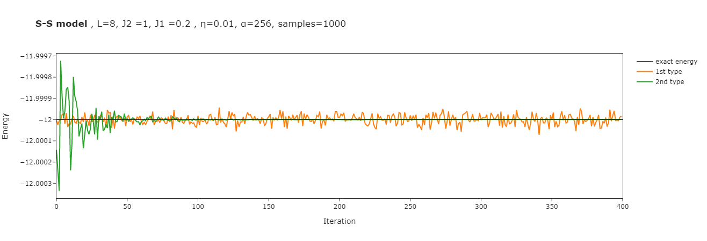

# Seznam důležitých poznatků

## Význam visible biasu
Volbou konkrétního visible biasu ($a_i$) můžeme specifikovat bázi. Lze zvolit takové $a_i$, které odpovídají MSR. 
**IDEA:** pokud $a_i$ necháme jako volný parametr, RBM si dokáže najít optimální bázi sám bez prior nastavování (ne)MSR

Na přidání biasu lze vlastně pohlížet jako na phase+modulus split, kde neuronová síť pro fázi je **triviální**, tj. váhy jsou v diagonální matici

:warning: **kontradikce s článkem Nomura (2020)** - https://arxiv.org/pdf/2001.02106.pdf :
- "*We neglect irrelevant one-body $a_l$ terms and optimize only $\{W_{lk}, b_{k}\}$ parameters.*"

### rozdíl mezi Nomurou a implementací `netket`u:

$$\text{Nomura:}\quad \log \sum\limits_{g\in G} \chi_g \phantom{\sum\!}\exp \left[{\color{gray} \sum\limits_i a_i T_g(\sigma)_i \,+}\, {\color{red}\sum\limits_k} \log 2 \cosh\left(\sum\limits_i W_{ik} T_g(\sigma)_i + b_k\right)\right]$$
$$\text{~~~netket:}\quad \log \sum\limits_{g\in G} \chi_g {\color{red}\sum\limits_k}\exp \left[{\color{gray} \sum\limits_i a_i T_g(\sigma)_i \,+}\, \phantom{\sum\!} \log 2 \cosh\left(\sum\limits_i W_{ik} T_g(\sigma)_i + b_k\right)\right]$$

- Zkusil jsem naimplementovat Nomuru

## moje poznámky k DL
- lol, CNNs mají fakt hodně parametrů (~100 milionů)
- resudial connections (DN with stichastic depth (layer dropout))