## Schůzka 18.11.2021
- https://www.netket.org/docs/_generated/samplers/netket.sampler.MetropolisExchange.html
    - n_chains
- ve .init_parameters by neměl být seed
- změna v SS_MSR na součet
- zkusit udělat `MetropolisLocal` namísto `MetropolisExchange` pro malé mřížky
    - při `TOTAL_SZ = None` v dimerové fázi
    - podaří se to zkonvergovat i v dimerové fázi?
- zkusit Jastrow ansatz na 6*6
- zkusit projet celý interval (pro N = 20) ještě jednou pomocí ED s `TOTAL_ST=0` a ověřit, že to dává stejné výsledky
    - možná to nebude třeba, protože Qspin to spočítal stejně
- rozdělit na amplitudu a fázi a 2*RBM (viz. tutorial netket3 9.)

### Úkoly:
- [x] znovu přegenerovat grafy se správným výpočtěm parametrů uspořádání pro MSR
- [x] vypnout `TOTAL_SZ` a zkusit `MetropolisLocal`
- [ ] Jastrow
- [x] rozštěpení na amplitudu a fázi

## poznámky
- výsledky mřížky `N=36`:
    - pro `TOTAL_SZ=0` a `MetropolisExchange` to hlouběji v DS a AF fázích konverguje relativně OK, ale v místě fázového přechodu to NEKONVERGUJE VŮBEC i když dám hodně moc samplů (1000) a iterací (1800) (viz. chaotický grav - v něm je ještě m_s a m_p pro MSR počítáno špatně)
    - v oblasti toho fázového přechodu jsem to projel podrobněji, ale moc to nepomohlo
- vypnuté `TOTAL_SZ` spolu s `MetropolisLocal` dává docela podobné výsledky jako `MetropolisExchange`
    - pro `N=16` je dobře vidět, že MSR báze konverguje v Neélově fázi a normální báze konverguje v dimerové fázi
- rozštěpení na amplitudu a fázi je předimplementované v modulu `RBMModPhase`, ale zatím mi to konverguje jenom někde
    - `DTYPE` obou RBMek je `np.float64`
    - η amplitudy 0 -> 0.01
    - η fáze      0.05 -> 0.01 ... stejně jako v tutoriálu netket3
    - asi si budu muset ještě pohrát s η a nebo přidat symmetrie

## Schůzka 26.11.2021
 - [x] 1) napočítat počty automorfismů pro 1D mřížku J1-J2 a zkontrolovat, jestli to sedí se skutečnými symetriemi
    - zjistit, kde je problém v RBMsymm
        - buď je problém v automorfismech (tj. symetrická báze není vlastní podprostor H)
        - nebo přímo v definici RBMsymm, jak to aplikuje
 - [ ] 2) udělat grid-search na metacentru pro RBMsymm (variovat ALPHA a ETA)
 - [ ] udělat grid-search na metacentru pro RBMmodPhase (variovat všechny možné hyperparametry)
    - udělat amplitudu symetrickou
 - [x] zdvojnásobit počet samplů (např 1500 samples) a nechat běžet dlouho na metacentru (několik dní - podívat se, kolik běželo předtím těch málo samplů, abych věděl, kolik tomu dát času)
 - [x] znovu proběhnout všechny mřížky (i 36 + zvýšit počet MC kroků) s RBM (ne-sym!) zatím bez rozdělením na modPhase
 

 ## poznámky
 1) funkce `automorphisms()` funguje správně - když přebarvím J_2
    - až na to, že nedokáže rozlišit mezi tím, když je stejná hrana vícenásobná
    - používají na to funkci: https://igraph.org/python/api/latest/igraph._igraph.GraphBase.html#get_isomorphisms_vf2

2) mám to ve složce SS_model/energy_plots/GrodSearch-symmRBM, ale ještě jsem to nezvizualizoval a nezanalyzoval

 - RBM (ne-symm) to počítá opravdu hodně rychleji a lépe
 - udělal jsem grid-search (v `eta` a `alpha`) pro RBMsymm v dimerové fázi (J2=0.3)
    - pro N=4 to NIKDY nenašlo gs (viz data ve složce GridSearch-symmRBM)
    - pro osatní to jsem submitnul na metacentrum
 - v nové verzi `3.2` netketu byla do `Heisenberg` přidána podpora různých kaplovacích konstant pro různé barvy hran grafu
    - a taky implementovalý nějaký Parallel Tempering sampler (nevím, jestli může být užitečný)

- Jaký mám použít Jastrow?
    - zkoušel jsem $ \log\psi(\sigma) = \sum_i a_i \sigma_i + \sum_{i,j} \sigma_i J_{i,j} \sigma_j $ - na malých mřížkách to fungovalo, ale pro N=36 to nenašlo dimerovou fázi, tak jsem to vzdal...

## další poznámky

- <a href="https://www.physicsforums.com/threads/when-does-a-wavefunction-inherit-the-symmetries-of-the-hamiltonian.643672/">link</a> In general the whole eigensubspace will be invariant under any transformation that leaves the hamiltonian invariant. For a one dimensional ground state that means you have invariance up to a phase factor.
- Jaktože Carleo nepoužíval MSR a přesto mu to našlo GS, který nesplňuje symetrie

## schůzka 3.12

- promyslet si jak naimplementovat symmetrie
- [ ] udělat dimer pomocí G-CNN - dokáží ho vyřešit?
- [ ] podívat se, jaké symmetrie v RBM jdou vypnout a zkusit si zadefinovat vlastní symetrie
    - zkusit udělat pouze **translace o 2**
- článek od sandvika (kniha ) - rozepsat si to pro dimer a promyslet si jestli/proč $K \neq 0$
- [ ] zkusit udělat dimerovou fázi v 1D a 2D
    - najít základní stav a podívat se, jaké je $K$ ?
    <!-- - symmetrie pouze translace -->

## poznámky
- vypnul jsem všechny ostatní symetrie a nechal jsem jenom translace o 2 a pořád mi to nekonverguje
- [ ] udělat si testy na dvou-dimerovém toy modelu
    - MSR konverguje tím lépe, čím více symetrií máme
    - bez-MSR to **nekonverguje po přidání (jakékoliv) symetrie**
    - dokonce všechny střední hodnoty permutací pro non-MSR non-Symm, která zkonverguje dobře, vychází správně $\langle \psi | \hat{P}_{01} | \psi \rangle = \langle \psi | \hat{P}_{23} | \psi \rangle = - 1$ a  $\langle \psi | \hat{P}_{02}\hat{P}_{13} | \psi \rangle = 1$
- zkoušel jsem na to spustit G-CNN, ale zatím mi to vubec nekonverguje :(
    - myslím, že by to mohlo být to kvůli tomu, že tam nejde nastavit `dtype=complex`
- zajímavý graf se observable swap

<!-- ### one dimer

A dimer is described by a hamiltonian
$$ H_{\text{one}} = \bm{S}_1\cdot\bm{S}_2 = \begin{pmatrix} 
1 & 0 & 0 & 0\\ 
0 &-1 & 2 & 0\\
0 & 2 &-1 & 0\\
0 & 0 & 0 & 1
\end{pmatrix}$$ -->

## Schůzka 10.12.

## poznámky
- Existuje druhá verze 20 sitového tilu: https://www.slideserve.com/najwa/thermodynamic-properties-of-the-shastry-sutherland-model

## Schůzka 16.12.
- zkusit napsat dimer pomocí "Lattice" a podívat se, jestli to dává stejné špatné výsledky
- zkusit si vypnout biasy v obou (RBM i RBMSymm) a pohrát si s 

## poznámky
$$ \psi(\sigma) = \exp\left(\sum_i a_i \sigma_i\right) \prod_k 2 \cosh\left( b_k + \sum_i W_{ik}\sigma_i\right)$$
- zkoušel jsem `RBMmodPhase`, ale nikdy se mi s tím nepodařilo zkonvergovat ani na dimeru
    - zkoušel jsem měnit všechny možná hyperparametry (learning raty pro obě sítě), ale nic...
    - možná to je tím, že obě takto definované RBMka nemají (ani nemohou mít) žádné visible biasy
        - šly by naimplementovat
$$ \psi_{\text{ModPhase}}(\sigma) = \exp\left[ \log\prod_k   2\cosh\left( b_k + \sum_i W_{ik}\sigma_i\right) + {\rm i}\log\prod_k   2\cosh\left( b'_k + \sum_i W'_{ik}\sigma_i\right)\right]$$
- zkoušel jsem `G-CNN` a dopadl jsem stejně
    - pak jsem zjistil, že `dtype` charakterů je potřeba nastavit na komplexní
    - funguje to krásně i na double dimeru
        - dokonce to ani nepotřebuje konvergovat, protože ze začátku to už je ve správném stavu
    - charaktery prozatím zadávám pouze ručně


- zkusit zjistit důvod proč nefunguje `RBMmodPhase`
- pak se přesunout k `GCNN` a replikovat předchozí výsledky (zatím pro `h=0`)
    - přes svátky pustit na nějaké větší mřížce

- [ ] spustit GCNN
- [ ] analyzovat proč selhává RBMmodPhase

## poznámky
- v AF fázi mi GCNN nefunguje :(
    - zkoušel jsem to pouštět na PBC řetízku o délce 3 a zvládlo to pouze MSR, což je divné, protože MSR by tam být nemělo

- v DS fázi by mělo být **MSR irelevantní**, protože zde neprobíhá interakce mezi dimery a každý dimer leží v jedné z podmřížek, takže na něj MSR neplatí
    - hmm, dalo by se implementovat striped MSR, které by platilo dobře na dimery?

- IDEA: if we don't know irrep of GS, could we treat its characters as a variational parameters in GCNN?

- graf konvergence pro $N=16$ v dimerové fázi vypadá docela zajímavě

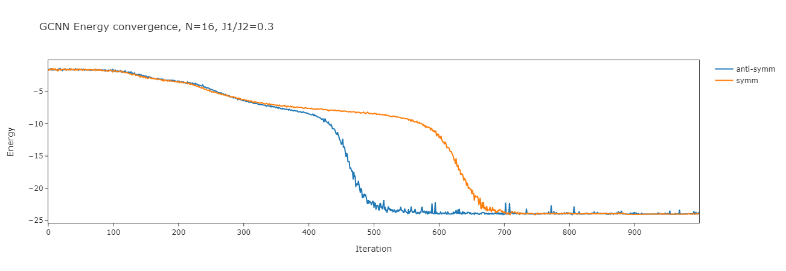

- **OBSERVATION: pro mřížky o hraně dělitelné 4 se základní stav v dimerové fázi transformuje pod TRIVIÁLNÍ IRREP** (všechny charaktery jsou +1)
    - bezpečně na to můžeme pustit `RBMSymm`
    - to protože všechny permutace symetrie mají kladnou paritu

- PROBLEM: GCNN hledá jenom symetrické stavy - funguje jenom pro **nedegenerované** základní stavy
    - v případě magnetizačních plat jsou ale GS určitě degenerované -> GCNN je nebude moci najít


# schůzka

- [x] pohrát si s metaparametry
- [x] zkusit používat přednatrénovanou neuronku z dané fáze a postupně přibližovat se k fázovému 
- [ ] začít psát note
- [x] přegenerovat nesymm-RBM pro 4*4 mřížku a pohrát si s hyperparametrami
    -   používat zapamatovanou síť z nějaké fáze
        - podívat se, jestli se dokáže z jedné překlopit do druhé
- [x] GCNN pro N=20 použít víc SAMPLES, abych zjistil, jestli graf konvergence už bude vypadat rozumně a nebudou tak zuby

# poznámky
- když je RBM stucklé ve špatné fázi, tak trvá hodně dlouho, než najde tu správnou
- model s pamětí asi není moc dobrý, protože sice stejnou fázi najde hned, ale změna fáze (to je to, co nás zajímá) mu dělá docela velké problémy
- IDEA: *Non-Boltzmann* sampling? ... aby se to lépe dostalo z lokálního minima

## AF phase
Example of N=8 convergence with exact sampler, η=0.01, α=16 (bez MSR). Porovnání
1. konvergence na J1 = 0.8 ze stavu, který je optimalizovaný pro J1 = 1.2
2. samotné konvergence rovnou na J1 = 0.8
3. konvergence na J1 = 0.8 ze stavu, který je optimalizovaný pro J1 = 0.4

(3.) případ nezkonverguje ani kdybychom byli hlouběji v AF fázi (pro J1 = 1.2 to dá totožný "konstantní" průběh)
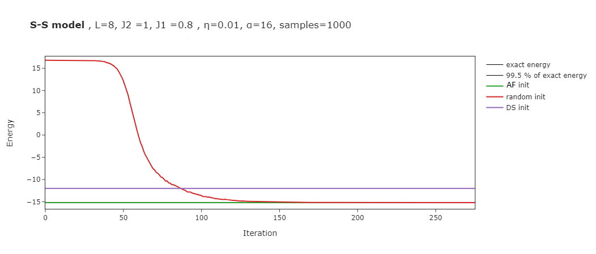

- fakt, že RBM(non-symm) nekonverguje úplně přesně do správné energie je pravděpodobně způsoben jenom hodně velkou variancí predikované energie
    - asi by se hodilo přidat errorbary (to nebude těžké)

## DS phase
Zde je porovnání konvergence pro J1=0.2.
1. inicializace v AF fázi (J1=1.2)
2. random inicializace
3. znovu inicializace v AF fázi (J1=0.8)
- inicializace v DS fázi vedle (J1=0.4) by vyšla zhruba konstantní na správné energii
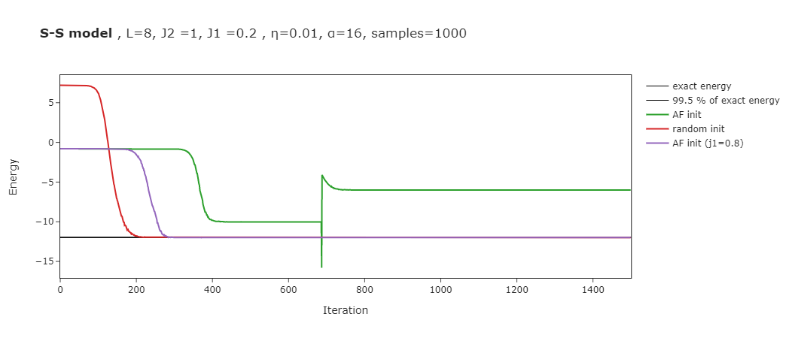

## GCNN issues 
- GCNN pro N=20 s více samples dělá stále takové divné zuby při konvergenci a nevím, čím to je
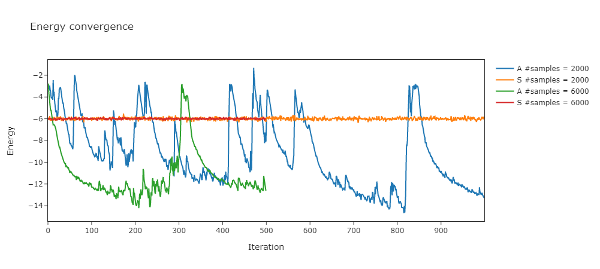. 

# schůzka 21.1.2022

- [x] **1)** zkusit stejný graf vygenerovat (postupné posouvání $J_1$ s předučeným modelem) pro `N=16`
    - potvrdí se stejná nesymetrie jako v případe `N=8` ?
- [x] **2)** zkusit jiný optimizer (např. SGD)
    - celou dobu jsem používal SGD na optimalizaci plus `Stochastic Reconfiguration` jakožto preconditioner -> **Natural Gradient Descent**
- [x] **3)** problematickou GCNN `N=20` zkusit s jinou optimalizační technikou
    - budou tam stále takové divné zuby?
- exact sampler nikdy nejde pod `exact_energy`
- V případě `exact` sampleru uvádět jako výsledek $\min(E)$ namísto $\mathbb{E}[E]$ přičemž minimum by stačilo brát z posledních ~300 kroků

## výsledky:

- **1)** ano, i pro `N=16` je zde stejná "nesymetrie"
  - 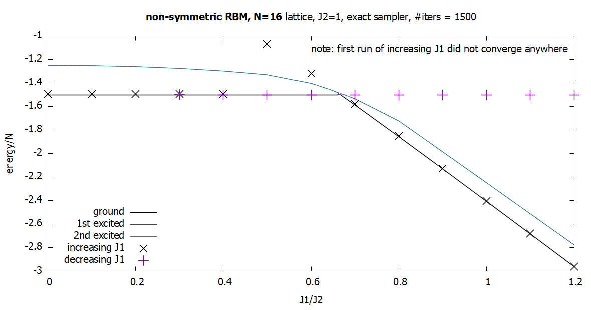
- **2)** porovnání *Natural gradient descent* a klasickéhu SGD (tj. s vypnutým preconditionerem)
  - *Poznámka: vanilla SGD bal zde cca o 30% rychlejší*
  - Závěr: spíš to nepomáhá (viz. obrázky)
  - 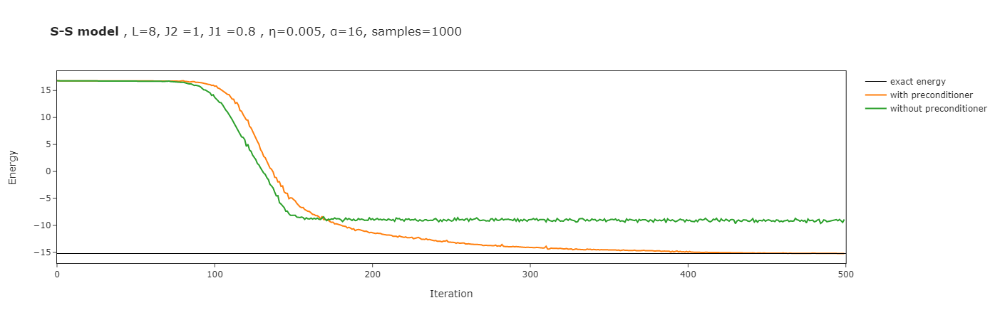
  - 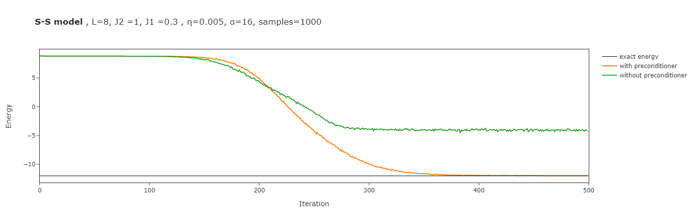
  MSR:
  - 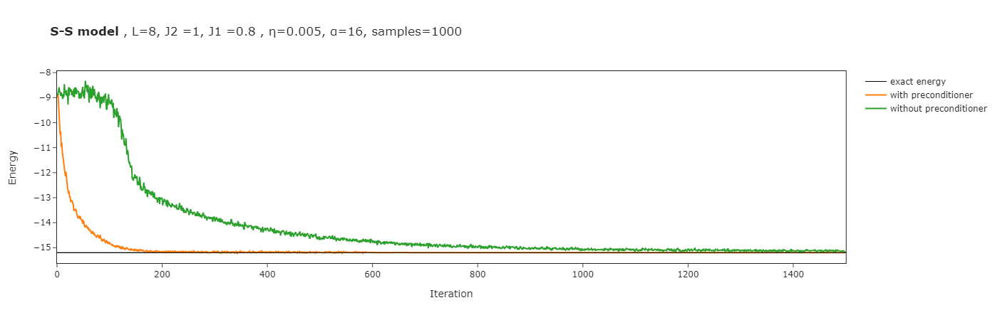
  - 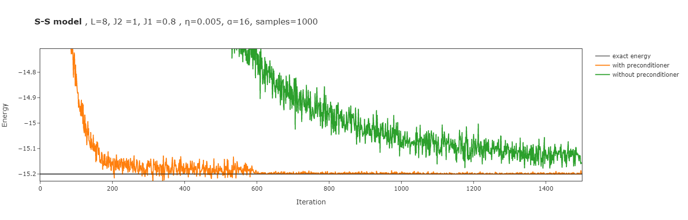
  - 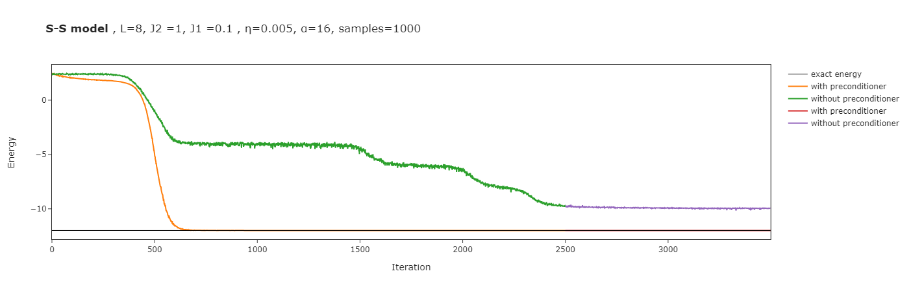
  - 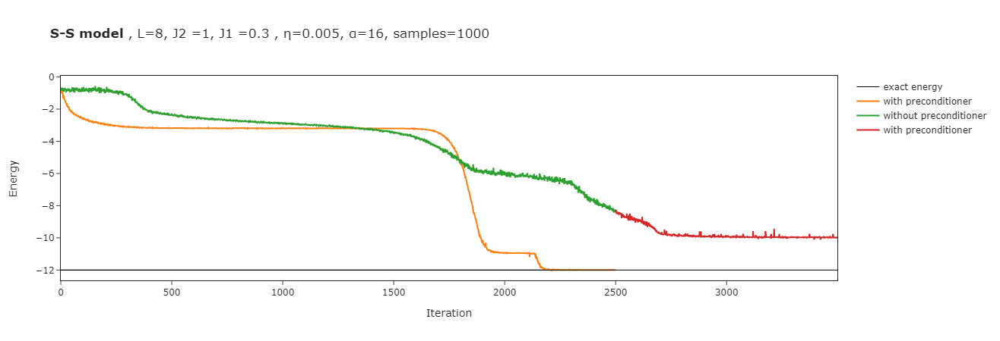
  - další důvod proč vanilla SGD není dobrý nápad viz. článek (Park and Kastoryano, 2020):
```
The standard approach would be to use gradient descent, but this performs very poorly for spin Hamiltonians, as the updates tend to get stuck oscillating back and forth along steep wells of the energy landscape rather than falling down the more shallow directions. 
```

### Jakou optimalizační techniku používám?
Stejnou, jakou používají ve všech tutoriálech a prostě všude.
```
optimizer = nk.optimizer.Sgd(learning_rate=ETA)     # Stochastic Gradient Descent
sr  = nk.optimizer.SR(diag_shift=0.01)              # Stochastic Reconfiguration
```
$$ \mathcal{W} \rightarrow \mathcal{W} - \eta S^{-1}\nabla_\mathcal{W} \langle {\sf \hat{H}} \rangle $$
where $S$ is *quantum Fisher information matrix*.

- **3)** výsledky: 
  - 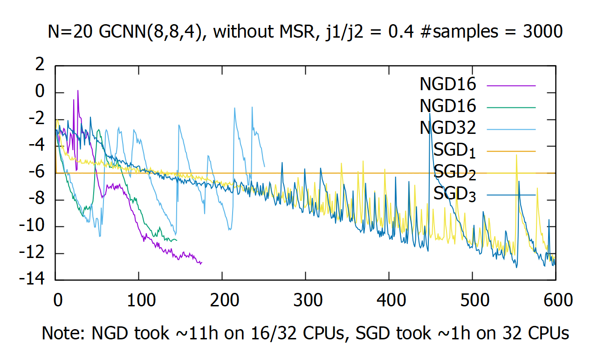

## schůzka 18.2.
- přečíst si článek Accuracy of RBM for one-dimensional j1-j2 heisenberg model
- Rozhodnout se, jestli používat symetrie (a případně to dobře zdůvodnit) 
- analyticky sepsat, proč je použití `SymmRBM` špatné (protože nemá visible bias - a snad ani nejde z principu přida?)
    - jde napsat `SymmRBM` s visible biasama nad netketem?

## moje poznámky
- TODO zkusit naimplementovat symmetrizovaný RBM (bude to hard, protože GCNN nepodporuje visible bias)