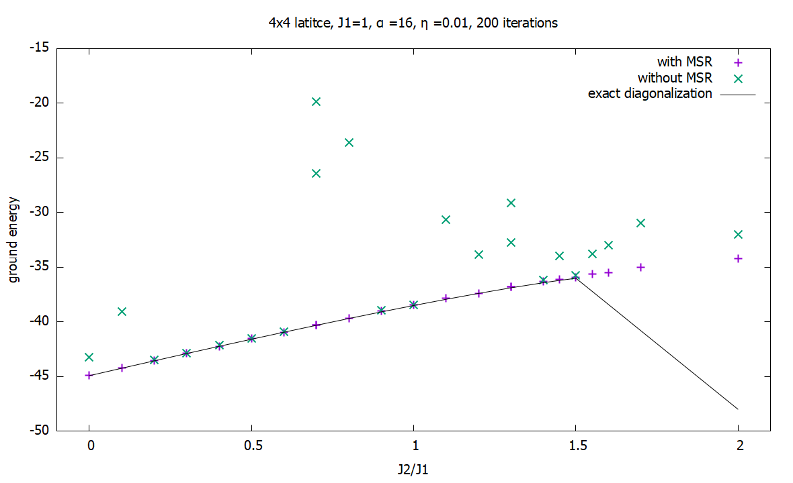
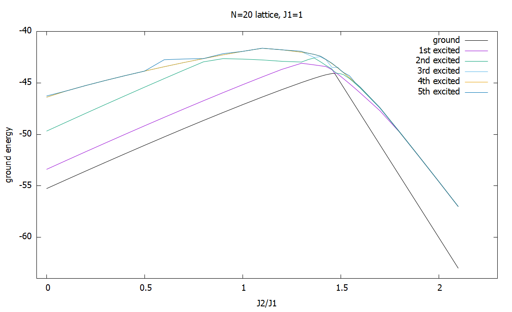

## moje poznámky

cože? zkonverguje mi to na poloviční energii?!
viz. srovnání 2x2 2D heisenberga a 4 1D heisenberga

možná bude problém někde v definici hamiltoniánu
možná to zkus debugnout napsáním hamiltoniánu pomocí .Hypercube(...) a přímo operátoru .Heisenberg(...)

takže nk.operator.Heisenberg(...) používá defaultně Marshall-like bázi v případě bipartitní lattice. Zkusím to spočítat v této bázi

menší problém?: exaktní diagonalizace dokáze spočátat max 5x5 mřížku, 6x6 už nee :( asdf

u Heisenberga mám problém s konvergencí pro některé hodnoty J2 (třeba 0,65) -- od článku Science se liším jen pár symetriema navíc (zrcadlením, a 90 stup rotací) 

pro SS model mi to zatím konvergovalo lépe, než pro heisenberga

## poznámky ze schůzky 2.10.2021
* zvolit nějaké pevné parametry
* udělat závislost E na J1/J2 pro RBMsymm s použítím MSR a bez použití MSR a taky exaktní diagonalizací (4*4 mřížka)
    * pokud bude čas, tak i závislost na parametrech RBM
    * zjistit, jestli se to někde zlomí

* spočítat taky magnetizaci (ne jen E) ... v MSR bázi by asi měla jít k 1, bez MSR by měla jít k 0

* fixnout j1/j2, která odpovídá experimentu, a přidat mag. pole $h$ -> přibudou plata?

* zkusit neuronku jako v signProblem (2020) 

* exaktní diagonalizace by mohla fungovat v SciPy

* některé střední hodnoty možná bude možné porovnát s článkem Yang,Sandvik2021 (parametry $m_s^2$ a $m_p$ - Figure 5.) (benchmark) - mají i 4*4 mřížky -> dobré na porovnání
    * neztrácet čas na definici středních hodnot proměnných, pokud to nepůjde snadno

## Moje poznatky

### výsledky Heisenberg
4x4 mřížka dává správný výsledek pro $J_2 = 0, 0{,}5$

### výsledky SS model
symetrická RBM konverguje hodně dobře (pouze za použití MSR), nesymetrická moc ne

MSR by mělo být OK i pro SS model - základní energie spočtena exaktní diagonalizací je invariantní vůči tomuto flipu znaménka

### zpráva

Dobrý den, posílám vám zprávu o svém postupu. V napsání Shastry-Sutherlandova hamiltoniánu nebyl problém. Akorát jsem narazil na manší potíž v ověřování, zda dostávám správné výsledky. Exaktní diagonalizace totiž zvlánde spočítat maximálně 5x5 mřížku, takže správnost výsledků pro S-S model s periodickými okrajovými podmínkymi jde kontrolovat maximálně na 4x4 mřížce. Na této mřížce mi symetrický RBM konvergoval hodně dobře k základní energii (i v kritických regionech okolo J_2=0,7), ale jen za použití báze adaptované na Marshallovo znaménkové pravidlo.   

### Průběžné výsledky SS modelu

Zkoušel jsem pro RBMsymm (s MSR a bez MSR) rozjet 4x4 mřížku SS modelu, ale divný výsledek je, že MSR báze konverguje VŽDY lépe. Normální bázi se mi dokonce zatím NIKDY nepodařilo úspěšně zkonvergovat k exact energy. 

#### teď zkouším opravit RBMsymm bez MSR pomocí j1j2 tutoriálu
Opravil jsem:
* diag_shift: 0.1 -> 0.01
* nk.nn.initializers.normal(stddev= 0.001 -> 0.01
* zkouším, jestli není problém v symetrizaci, tedy použít jen RBM

Pozn: RBM funguje na Isinga POUZE pokud je tam nenulové mag pole `h`, jinak to dává špatné výsledky!!

## Nové poznatky 16.10.2021

Problém byl v tom, že v nové vezri netketu používá RBM defaultně **reálné** parametry. Ve starší verzi používal defaultně komplexní hodnoty.
Takže jsem použil **RBM s komplexními parametry** a zjistil, že to zkonverguje i bez použití MSR.

<!---  -->

Ve všech příkladech mají přímo hilbertův prostor restrigovaný na `total_sz = 0`, takže principiálně ani nemůže vyjít jiná magnetizace než `0`. Mám tuto podmínku tedy zrušit?
`Note that we impose here the total magnetization to be zero (it turns out to be the correct magnetization for the ground-state). As an exercise, check that the energy of the lowest state in other magnetization sectors is larger.` Velikost Hilbertova prostoru je tedy $\begin{pmatrix}N \\ {N/2} \end{pmatrix}$ namísto $2^N$.
 * Zkoušel jsem vypnout restrikci na celkovou magnetizaci a bez fixnutí `total_sz = 0` to konverguje o poznání hůře.

Zkoušel jsem diagonalizovat nějakou scipi metodou `scipy.sparse.linalg.eigsh`, která je přímo určená na diagonalizaci hermitovských matic, ale nejspíš Netket používá vnitřně to samé, protože jsem dostal `RuntimeError: The hilbert space is too large to be indexed.`.

Neuronovou síť jako v článku (Szabó, Castelnovo 2020) už mám skoro napsanou. Podle tutoriálu jsem zatím udělal dost podobnou neuronku, ale ještě to není přesně stejné.

### otázky

- Neměl bych neuvažovat translační symetrie? Protože v PS phase to vypadá, že je translační symetrie porušena (resp. je s dvojnásobnou periodou). V některých případech je prý lepší nepoužít nějaké symetrie. Viz: https://github.com/netket/netket/discussions/838: `While symmetries should make a state easier to learn, I do recall that using the full space or automorphism group (instead of the usually easier-to-handle translation group) can sometimes introduce convergence issues (which at least need some more careful tuning of optimization settings and probably initial params to overcome).`
- Našel jsem článek, kde už aplikovali neuronky na S-S model (ještě jsem to nepřečetl)
- Vyšší motivace? Proč to vůbec děláme? (psaní úvodu dp)

## JAX / FLAX
 - uses **asynchronous execution**:
    - pythonový kód nečeká, než se JAXové operace provedou, a jede dál
    - nedostává normální proměné, ale `futures`, které může dál předávat JAXovi, aby na nich dělal další operace
    - pokud chceme počkat na provedení, buď převedeme do `numpy` objektů nebo zavoláme `block_until_ready()`
 - JAX arrays are immutable (`updated = jax.ops.index_update(x,(0,0), 3.0) # whereas x[0,0] = 3.0 would fail`, 
`jax.ops.index_update(x,jax.ops.index[0,:], 3.0) # Same as x[O,:] = 3.0 in NumPy.`, `x.at[0,:].set(3.0) # Note: this returns a new array and doesn't mutate in place.`)

## poznámky ze schůzky 20.10.2021
- vykreslit první tři základní stavy spočtené Lanczoszem a vykreslit stejný graf a poslat [DONE]
- v prostoru, kde to nekonverguje, zkusit vypnout total_sz = 0
- prostudovat si základní fáze S-S modelu a indentifikovat relevantní veličiny (kde jsou fázové přechody a jak je měřit)
- zkusit na fázový přechod použít CNN rozdělenou na amplitudu a fázi (jako v článku ale menší)
- zkusit 4x6 buňku - bude tam hrana?

## Nové poznatky
- 6x4 nespočítá ED :(
- po vypnutí `total_sz = 0` to konverguje opravdu mnohem hůř; spíš vůbec :/
- na metacentru mi funguje `netket` hurááá!!
- Jaký je optimální workflow při práci na metacentru? Mám používat git nebo jenom manuálně copy-pastit soubory ze svého pc na server?
- Výpočetní síla ED:
    - N=30 ... can't be indexed
    - N=21 ... `Error: Kernel is dead`
    - N=20 ... zvládne to za 30 s
    - N=19 ... zvládne to za 13 s
    - N=18 --- zvládne to za 6 s
- tiles:
    - ze symetrických důvodů je pro mě relevantní pouze případ N=20, protože jako jedinný je dělitelný 4 (z důvodu PBC)
    - ! zrovna N=20 mají v článku špatně nakreslený!
    - pro nectvercove mrizky to najde jako symetrie pouze translace (tj. pro `N=20` mám `20` symetrií)

## schůzka 25.10.2021

- zjistit, jaká je v daných oblastech fáze
    - lanczoszem vypočítám základní stav
    - spočítám z něj nějaký relevantní parametr uspořádání
    - necháme nějaký operátor působit na eigenvektor
    - v YSandvik vypadá zajímavě `m_s^2`
    - pozriet si strukturní faktor (zkusit to možná napsat obecně jako obecný vztah pro strukturní faktor v závislosti na $Q$ (FT))
- obecnější cíle:
    - třetí fází očekáváme podle článku mezi 1,29 až 1.53
        - pro malé mřížky však není jisté, jestli tam vznikne
    - víme, že na okrajích jsou dvě rozdílné fáze DS & Néél
    - chceme ukázat, že obě jdou najít pomocí ML
    - hledáme síť, která dokáže popsat obě
- na metacentru napsat vlastní modul (install to your own to your home directory)
- zrušit některé symetrie na nechat běžet dlouho na metacentru
- otočit J2/J1 na J1/J2
- dobrovnolné: pythonovský balíky qtip a **QuSpin** na exaktní diagonalizaci
- **fixnout J2 = 1** a měnit pouze J1
- na velké mřížce by to mohlo fungovat lépe

Úkoly
1) naimplementovat výpočet $m_p$ a/nebo $m_s^2$ jako v článku Sandvik a použít pro eigenstavy získané z ED (data můžeme zeskenovat programem g3data) -> udělat grafy závislosti parametrů na J1/J2 -> porovnat s článkem Sandvik (udělat pěkné obrázky, které by šly do práce) pro všechny přížky N = 4,8,16,20 (možná zkusit 24 na mtcntre)
2) zopakovat zévislost ground state na J1/J2 a pod něj obrázek závislosti skrukturních parametrů z bodu 1) pro různé mřížky

## poznatky
 - podařilo se mi naimplementovat výpočet $m_s^2$ pro eigenstavy z exaktní diagonalizace
 - implementaci $m_p$ už skoro taky mám, ale podle (Sandvik, 2020) je $m_p$ použitelný, jen při $\mathbb{Z}_2$ symmetry-breaking (cylinder)
    - rozdíl $\hat{\bm{Q}}$ se počítá pro plata, která sousedí hranou nebo rohem?!?? znamená 'empty' bez S-S vazby?
 - v kritickém bodě pro 2*2 mřížku je lanczos_ed nestabilní (dokonce ani nevrací strukturní faktor v intervalu nejnížší a nejvyšší hodnoty jinde)
 - moje implementace výpočtu $m_s^2$ je docela pomalá (pro N=16 je to cca 4x pomalejší než ED), ale $m_p$ je rachlá
 - podařilo se mi na metacentru zprovoznit `netket`, ale ~~dělám to přes condu, což prý není doporučené, protože to nepodporuje MPI (nevím, jestli to potřebuju) a taky je to starší verze netketu `3.0b2`~~ dělám to přes python3.7 (novější verze pythonu tam nejdou přidat s pipem) což je asi ok, protože na netket je potřeba python>=3.7
 - test: u mě to běželo ~13 sekund, na metacentru ~21

 ## Schůzka 5.11.2021

 - plaquetty jsou to sousedící vrcholem -> opravit
 - napsat do skupiny, jak jsem rozběhl metacentrum

 ### Úkoly:
 - napočítat strukturní faktor pro dimer phase (viz. vzorec v nb)
    - objevuje se nová fáze už v N=20?
 - vyzkoušet RBM na všech mřížkách N=4,8,16,20
    - bude to špatně pro všechny mřížky?
 - zjistit, jak se v netketu dají počítat strukturní faktory z neuronky
 - proskenovat prostor fourierových obrazů (viz. obrázky na konci ... k_x, k_y)
    - hluboko v DS, AF, a pak někde blízko k přechodu

## moje poznámky
 - výpočet $m_s^2$ se výrazně zrychlil tím, že nejdřív posčítám operátory a až nakonec to pomocí `np.matmul()` spočítám střední hodnotu
    - ALE pro N=20 mi program v Jupyteru vždy spadne, takže jsem matmulení vnořil o jeden for cyklus hlouběji
    - vypadá to, jakoby se nějak rozbyla komunikace numpy s pythonem, protože podle vytíženosti proces pořád běží, ale python na něj už nečeká
        - možná `numpy` nezvládne násobit moc málo řidké matice
    - na metacentru mi to pro N=16 vždy fungovalo, ale N=20 se mi nepodařilo
 - problém:  v tom relevantním intervalu $J1/J2 \in (0,1.2)$ to RBM bez `total_sz = 0` skoro nikdy nekonverguje dobře
    - ~~z nějakého důvodu mi nový kód nekonverguje a starý mi konvergoval o dost líp~~
    - ~~musím to vypátrat postupným mergováním kódů <-- bylo to `total_sz = 0`~~
 - výsledek: bez použití `total_sz = 0` restrikce na Hilbertův ptostor to skoro nikdy nezkonverguje (ani s MSR)
 - bez `total_sz = 0` je konvergence fakt nanic...

## Schůzka 12.11.2021
- Grupa p4g
- vykreslit závislot při použití RBM s (MSR i bez) -> mít z toho 4 obrázky
- jak je to vlastně se symetriemi RBM? - jak je to řešené v RBMsymm?
- potom to rozdělit na fázi a amplitudu (a obě počítat pomocí RBM)
- spočítat parametr $\sum_i \langle S_i \cdot S_i \rangle$ ... v Néélově fázi by to mohlo vyjít $\frac{3}{4}N$ (tedy pro mě $3N$)
- 18 sites mřížka: 1,3,5,5,3,1

### Úkoly:
- [x] fourierův obraz pro ED - pro `4*4` mřížku vskutku od 0 až po $2\pi$
    - jeden hluboko v Néélově fázi
    - jeden hluboko v druhé fázi 
- [x] vykreslit závislot při použití RBM s (MSR i bez) -> mít z toho 4 obrázky
- [ ] rozložit to na amplitudu a fázi a použív 2x RBM

## moje poznámky
- v článku (Yang, Sandvik 2021) mají hodně spatně strukturní faktor na konci 
    - chyba v indexech $i,j$
    - chyba ve faktoru $1/L$ -> $1/L^2$
- zatím nevím, jestli mám na metacentru dávat víc jader - jestli to umí paralelizovat?
- zatím jsem měl všude velikost skryté vrstvy $\alpha = 16$
- jak se v NN vůbec něco dokazuje?